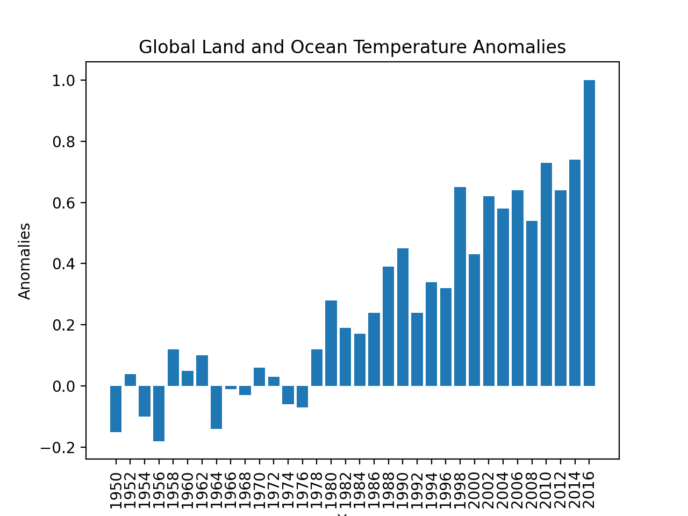
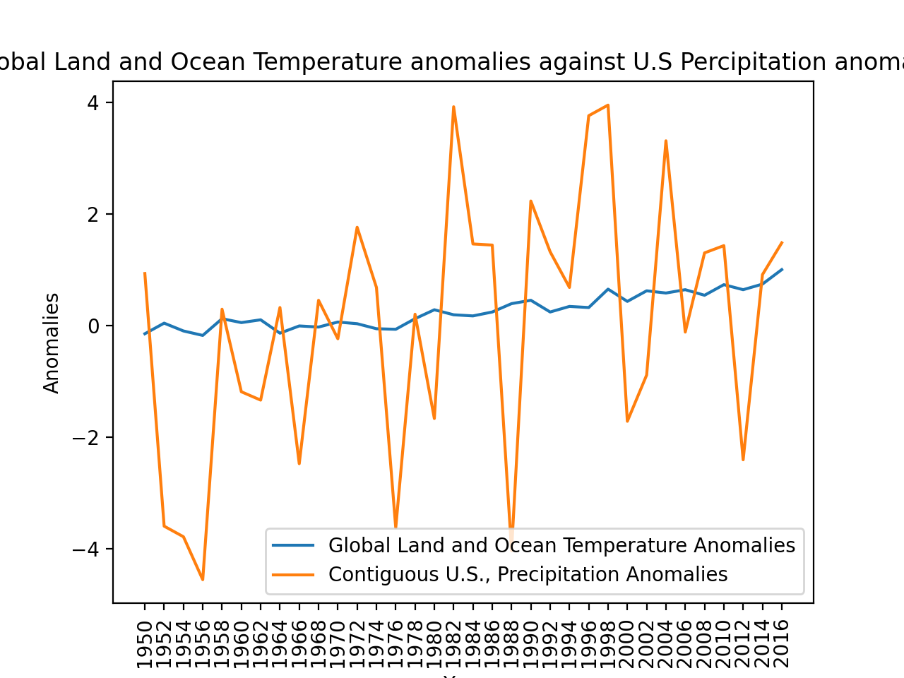

# Anomalies of Our Climate from 1950 to 2016
## Global Land and Ocean Temperature Anomalies

The term temperature anomaly means a departure from a reference value or long-term average. A positive anomaly indicates that the observed temperature was warmer than the reference value, while a negative anomaly indicates that the observed temperature was cooler than the reference value.
[Link to Global Temperature Data Set](https://www.ncdc.noaa.gov/cag/time-series/global/globe/land_ocean/ytd/12/1880-2016.json)
## Global Temperature Anomalies with Contiguous US Annual Precipitation Anomalies

Here we can see increases for Global temperature and US percipitation anomalies from the year 1950 to 2016. As average temperatures at the Earth's surface rise, more evaporation occurs, which, in turn, increases overall precipitation. Therefore, a warming climate is expected to increase precipitation in many areas. 
[Link to US percipitation anomalies](https://www.ncdc.noaa.gov/cag/time-series/us/110/00/pcp/ytd/12/1895-2016.json?base_prd=true&begbaseyear=1901&endbaseyear=2000)
[Link to Course Page](https://github.com/mikeizbicki/cmc-csci040/blob/2020fall/hw_02/README.md
)

